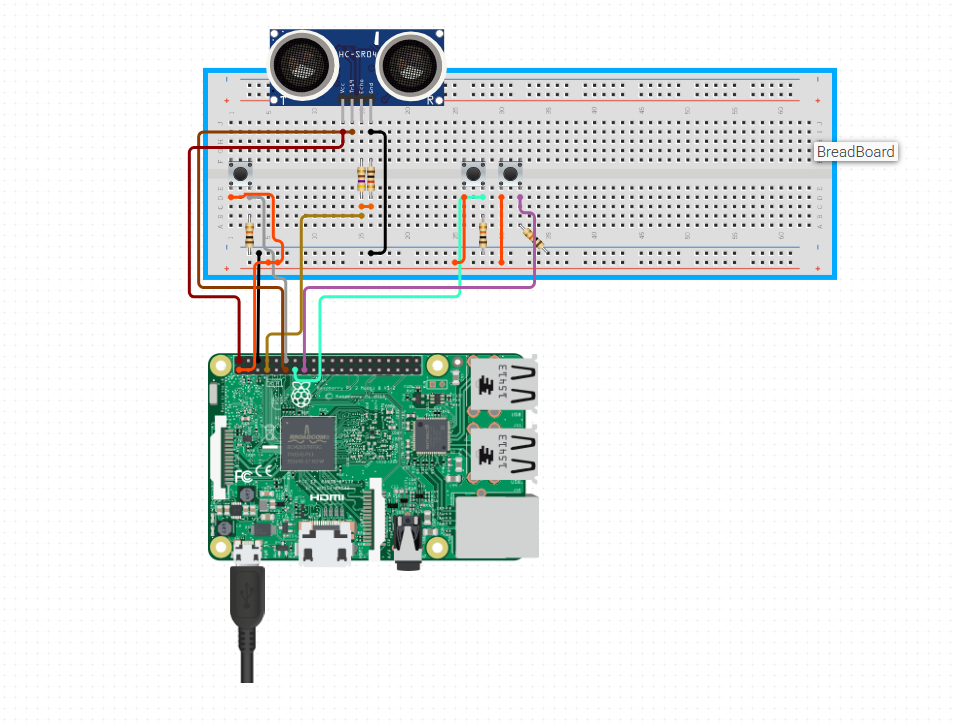

## Description
This will play given audio files via bluetooth speaker if the sensor is triggered/walked by in reach of 1.5 meters.

## Setup
- audio files -> /home/user/ (need to be wav or ogg files)
- python skripts -> /opt/sensor/ (give user execution privileges to both)
- in button_listener.py put your speaker mac adress as target (line 19)
- in button_listener.py put your username in the target folder string(line 22)
- create user service -> ~/.config/systemd/user/
- enable and start the service that will manage the scripts via systemctl

## Wiring

The GPIO pins for the buttons are not correct in this image.

> gpio mode = Board

> bluetooth button = 29

> start script button = 26

> manual trigger button = 31

> Resistors -> look up individually(between 850 and 1.2)

## Usage
- Enable Bluetooth Speaker
- Plug in the pi to power
- it will try to connect automatically
- if it does not work press the bluetooth connect button to force a connection if the device is on
- press the start button to start the sensor script - this process cannot be aborted via button
- press the play manually button to play a random sound manually as a fallback to the sensor trigger